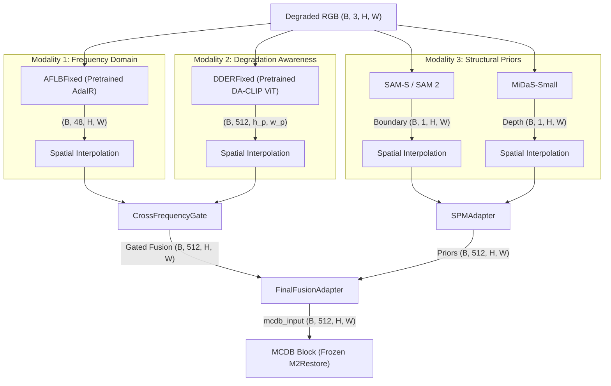

# HoCVid Multi-Modal Image Restoration Pipeline
**Architecture & Implementation Specification**

This document serves as the complete technical source of truth for the HoCVid pipeline as currently implemented. It details the exact data flow, module architecture, pretrained weight usage, bug fixes, and freeze/unfreeze training policies.

---

## 1. High-Level Objective
The HoCVid pipeline acts as a sophisticated, multi-modal feature extractor and fuser. It ingests degraded RGB images alongside expert structural priors and extracts a rich, degradation-aware, frequency-enriched hidden representation. 

**Critical constraint:** The absolute final output of this pipeline must be a tensor of exactly `(B, 512, H, W)`. This tensor is fed directly into a frozen **MCDB (Mamba+CNN) block** from M2Restore using `strict=True`. MCDB expects a perfect 512-channel physical space; HoCVid’s job is to orchestrate multiple modalities to provide the best possible 512-channel input.

---

## 2. Pipeline Architecture & Data Flow

---

## 3. Module Breakdown & Implementations

### A. AFLB (Frequency Domain Preprocessing)
*   **File:** `aflb_fixed.py`
*   **Role:** Decomposes the image into frequency domains using FFT/IFFT to isolate artifact signatures without destroying structural context.
*   **Status:** Pretrained AdaIR weights loaded. Backbone frozen. The internal `FreModule` (Fourier operations) is trainable.
*   **Bug Fixes Implemented:**
    1.  **Tinting Bug:** Originally used `torch.abs()` on the IFFT output, destroying conjugate symmetry and causing a massive yellow/green color shift. Fixed by using `.real`.
    2.  **Resolution Bug:** Empty mask calculation for small patches fixed using a `max(1, ...)` threshold calculation.
*   **Output:** `(B, 48, H, W)`

### B. DDER (Degradation-Aware CLIP embedding)
*   **File:** `dder_fixed.py`
*   **Role:** Uses a ViT backbone and a Mixture-of-Experts (MoE) router to determine the specific degradation types present in the image (blur, noise, rain, etc).
*   **Status:** Pretrained DA-CLIP weights loaded. ViT backbone is completely frozen.
*   **Bug Fixes Implemented:**
    1.  **Channel Truncation:** The original code brutally sliced `feats_map[:, :512, :, :]`, throwing away 33% of the 768-channel ViT features. We implemented `vit_proj` (`nn.Conv2d(768, 512, 1)`) to cleanly compress and learn from all 768 channels.
    2.  **Output Level:** Replaced the original pixel-level output with a `forward_features()` method to extract the hidden `(B, 512, h_p, w_p)` tensor required for MCDB fusion.
*   **Trainable Parts:** The new `vit_proj` and the MoE router.

### C. Structural Priors (SAM & MiDaS)
*   **Role:** Foundational models providing absolute ground truth on what is an object edge (SAM) and geometric depth (MiDaS).
*   **Status:** Off-the-shelf HuggingFace models. Completely frozen.
*   **Output:** `(B, 1, H, W)` each.

---

## 4. Fusion Mechanisms (The Adapters)
All fusion logic lives in `fusion.py`. It uses a "ControlNet" methodology to guarantee that advanced fusion does not destroy the pretrained baseline performance at Step 0.

### 1. CrossFrequencyGate (Feature Interaction)
*   **Goal:** Fuse 48-channel AFLB features with 512-channel DDER features intelligently, avoiding feature drowning.
*   **Design:** Bidirectional Gating.
    *   **SpatialGate:** DDER's spatial statistics (max/mean pool) pass through a 7x7 conv to gate *where* AFLB frequency information is injected. DDER knows where the degradation is.
    *   **ChannelGate:** AFLB's channel statistics (GAP/GMP) pass through an MLP to gate *which* DDER channels get boosted. AFLB knows the frequency signatures of the artifacts.
*   **Status:** Trainable from scratch (~0.32M parameters).

### 2. SPMAdapter (Structural Prior Adapter)
*   **Goal:** Convert the 2-channel concatenation of SAM+MiDaS into a 512-channel feature map.
*   **Design:** Deep Conv-BN-LeakyReLU pyramid (`2 -> 32 -> 128 -> 512`). 
*   **ControlNet Trick:** The final convolution predicting the 512 channels is explicitly `zero-initialized`. At Step 0, this adapter outputs EXACTLY zeroes. This prevents massive [0,1] depth scales from blowing up pretrained `N(0,σ)` DDER feature distributions.
*   **Status:** Trainable from scratch (~0.63M parameters).

### 3. FinalFusionAdapter (The Combiner)
*   **Goal:** Intelligently merge the gated main branch (DDER+AFLB) with the structural priors (SPMAdapter).
*   **Design:** Concatenates `(B, 512)` and `(B, 512)` into 1024 channels. Squeezes via `1x1 Conv` to 512, applies `LeakyReLU`, and smooths via `3x3 Conv`.
*   **Residual + Zero-Init:** The final 3x3 conv is zero-initialized, and it acts as a residual branch: `output = adapter(concat) + gated_fused`. At Step 0, `adapter(concat)` returns 0, meaning `output = gated_fused`.
*   **Status:** Trainable from scratch.

---

## 5. Parameter & Freeze Summary
The top-level `HocVidModel` (`model.py`) orchestrates everything. 

*   **Total Parameters:** ~95.54 M
*   **Frozen Parameters:** ~87.85 M (AdaIR encoder/decoder, DA-CLIP ViT, MCDB, SAM, MiDaS)
*   **Trainable Parameters:** ~7.70 M
    *   AFLB `FreModule` (Fourier processing)
    *   DDER MoE Router + `vit_proj`
    *   `CrossFrequencyGate`
    *   `SPMAdapter`
    *   `FinalFusionAdapter`

## 6. How to Read the Codebase
*   `aflb_fixed.py` / `dder_fixed.py`: Wraps pretrained code, applies bugfixes cleanly without overwriting original vendor files.
*   `fusion.py`: Contains all 3 custom adapters (`CrossFrequencyGate`, `SPMAdapter`, `FinalFusionAdapter`) and the core `HocVidFusionPipeline`.
*   `model.py`: The `HocVidModel` class. Manages all paths, weight loading, model instantiations, freeze logic loops, and the master `forward()` method.
*   `test_pipeline.py`: Comprehensive test suite verifying that every module produces perfect shapes and that 0.0 zeroes are propagated correctly through the ControlNet structures. All 6 tests currently pass perfectly.
